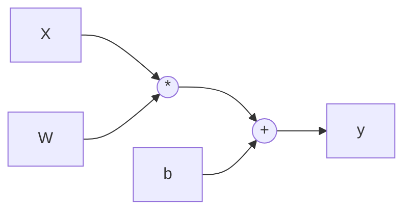
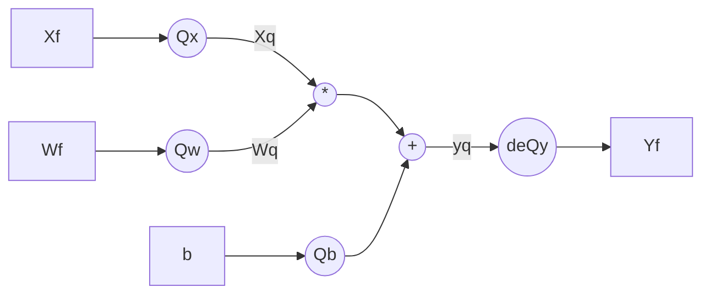

Neural Network Quantization
====
> Written with [StackEdit](https://stackedit.io/).
# Introduction
This is a reading note of [Quantizing deep convolutional networks for efficient inference: A whitepaper](https://arxiv.org/abs/1806.08342). 

## Modeling simulated quantization in forward and backward
The basics of Quantization aware training is how to model the quantized effect of inference during training. 
Let's consider a `Conv` layer like $$y = \omega * x + b$$. In the origin block, all variables are float.

In the simulated quantization in training, the `forward` diagram is like

